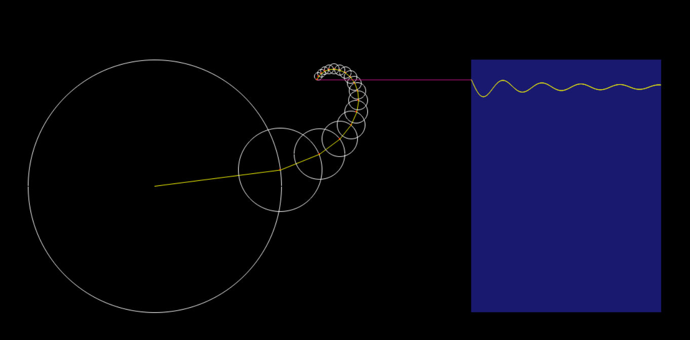

### Fourier Series

Going from a sinusoidal wave to a square wave.

#### Requirements:

- Python 3.8 or above
- [pygame](https://www.pygame.org/)

#### Installation Steps:

```bash
git clone https://github.com/shelldoom/fourier_series
pip install -r requirements.txt
python ./main.py
```




